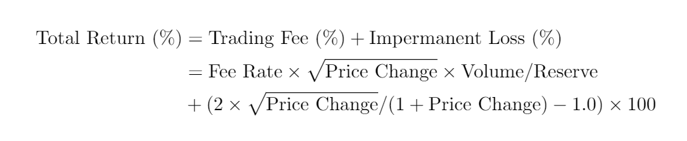

# LP strategies

Last updated on 01/27/2022.

This dataset consists of the daily token price, reserve, and volume data of 34 different WETH pools in Uniswap V2, from 09/14/2020 to 01/26/2022.
The list of tokens is as follows:

- ALBT
- CEL
- COMP
- DAI
- DPI
- FARM
- HEX
- KEEP
- LEASH
- LINK
- LRC
- MANA
- MATIC
- MKR
- PERP
- PICKLE
- REN
- RSR
- SAND
- SHIB
- SNX
- STAKE
- STRONG
- SUSHI
- USDC
- WBTC
- AMP
- AMPL
- CRV
- RENBTC
- SWAP
- USDT
- XOR
- YFI

The dataset has two versions, `train` and `test`.
The `train` dataset spans from 09/14/2020 to 10/31/2021 whereas the `test` dataset contains the whole dataset, which means that the data from 11/01/2021 to 01/26/2022 can be only accessed within the `test` dataset.
I did this just to avoid the look-ahead bias.

Period | Frequency | Start Date | End Date | Samples
:--:|:--:|:--:|:--:|:--:
Training | Daily | 09/14/2020 | 10/31/2021 | 413
Testing | Daily | 11/01/2021 | 01/26/2022 | 87

The `observables` are the daily token price, reserve, and volume for each token, which leads to a total of 3 x 16 = 48 columns.
The `targets` are the estimated daily returns for each token pool, which was calculated by the following:

where *Fee Rate* is given as 0.3 in Uniswap V2 and *Price Change* is defined as *Price_t / Price_t-1*.
Due to the shift (or lag) operator involved in the calculation, the `targets` start from 09/14/2020 whereas the `observables` start from 09/13/2020 for the `train` dataset.

## Benchmarks

Below shows the average performance for some benchmark models, aggregated from 10 different random seeds.
The performance was measured as the sum of Root-Mean-Square Error (RMSE) from the `targets` of each token pool ignoring outliers.
Outliers were defined as the data points that are further than 1.5 x IQR (Interquartile range) from the first and third quartiles.
The performance was measured for the testing period (11/01/2021 - 01/26/2022).

### Short-term Forecast - 1 Day

Model Name | ΣRMSE | Std
:--|:--:|:--:
Previous Day | 3.8291 | -
Moving Average (10 days) | 2.3202 | -
Linear Regression | 1.5383 | 0.0015
Robust Regression + Stepwise OLS | 1.7495 | -
Prophet (default) | 1.6217 | -

### Long-term Forecast - 10 Days

Model Name | ΣRMSE | Std
:--|:--:|:--:
Previous Day | 5.6349 | -
Moving Average (10 days) | 2.4263 | -
Linear Regression | 1.5209 | 0.0012
Robust Regression + Stepwise OLS | 1.7510 | -
Prophet (default) | 1.6684 | -
